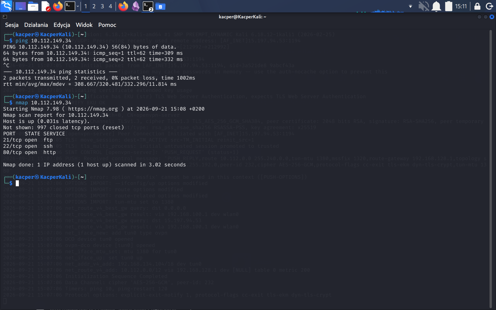
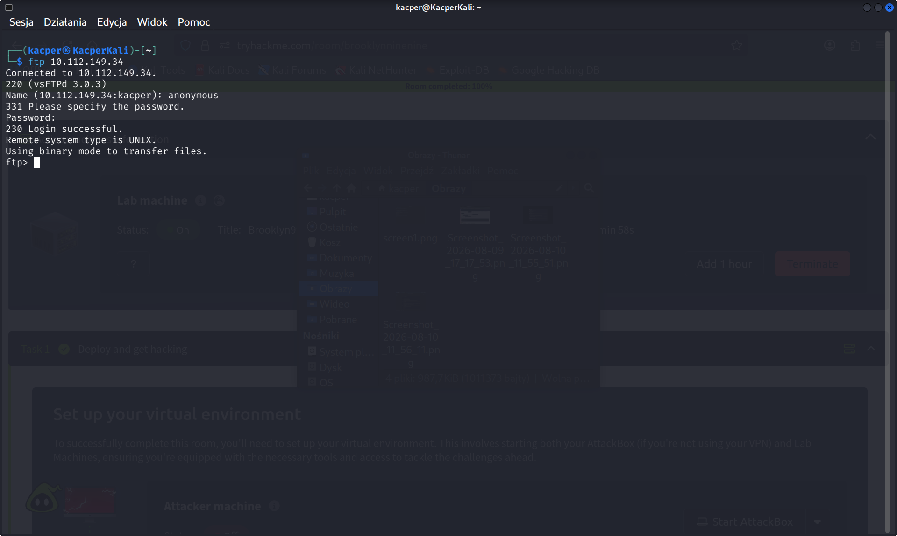
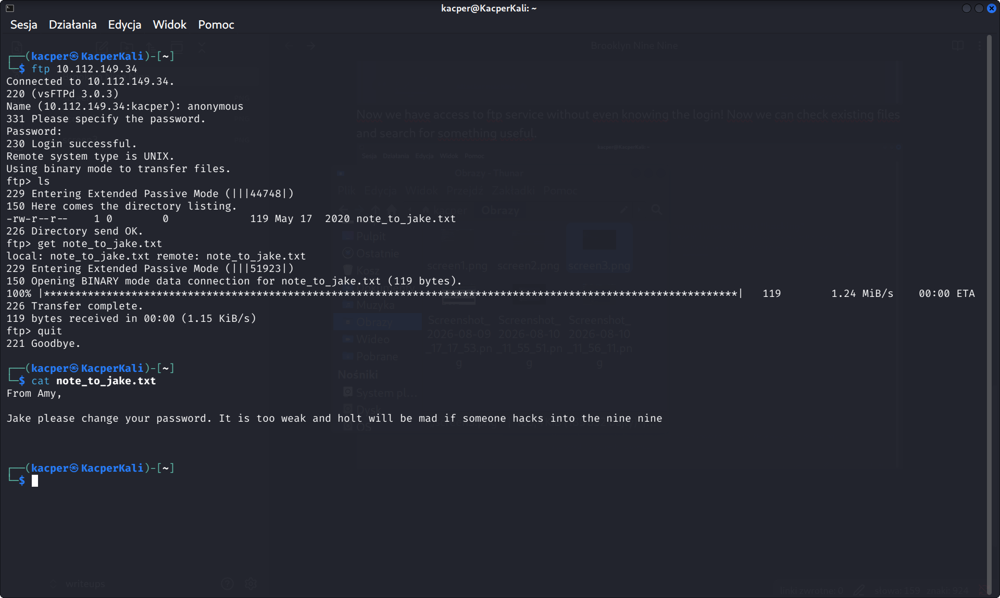
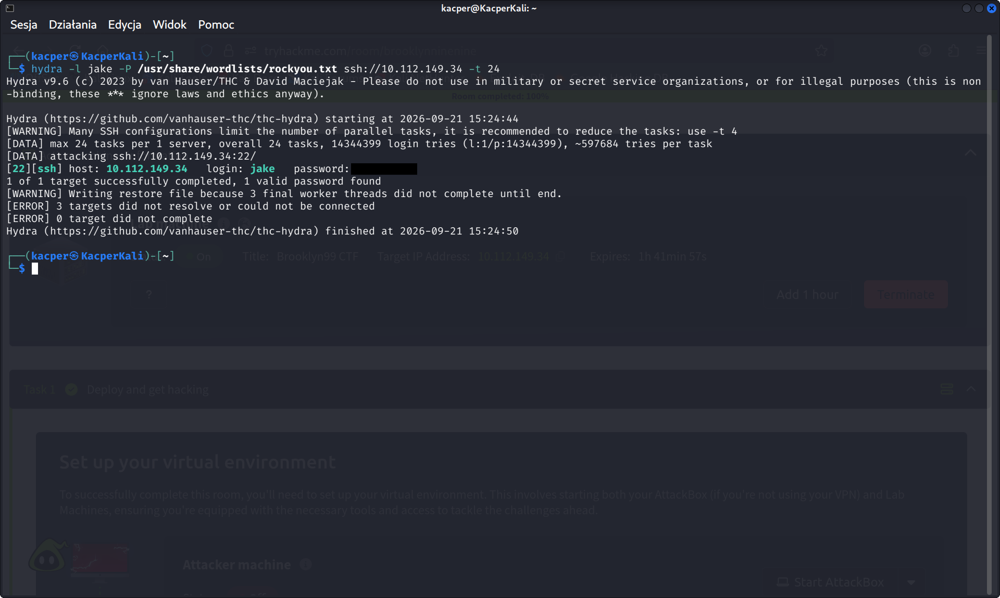
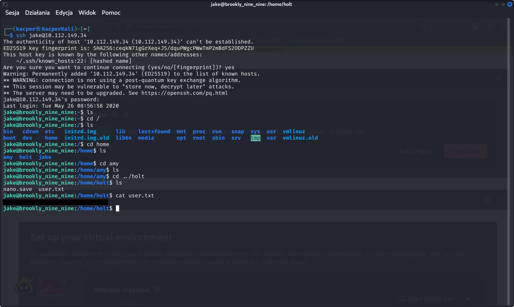
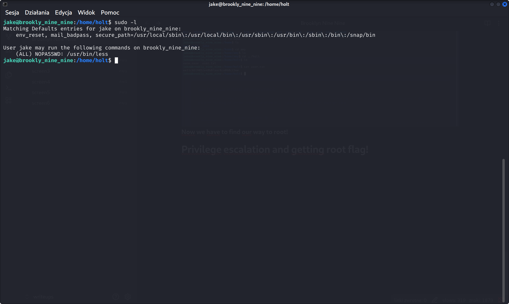
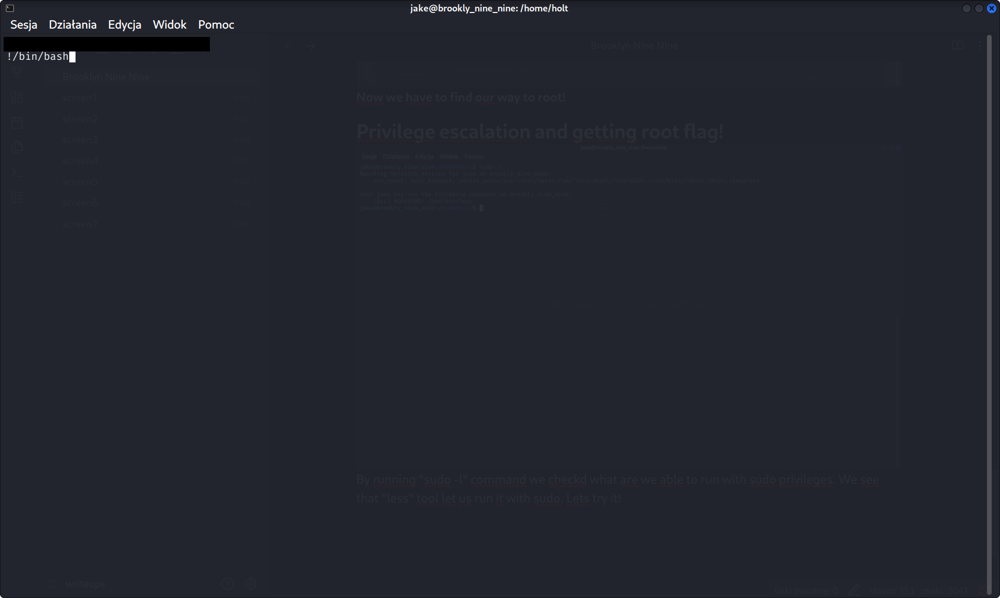
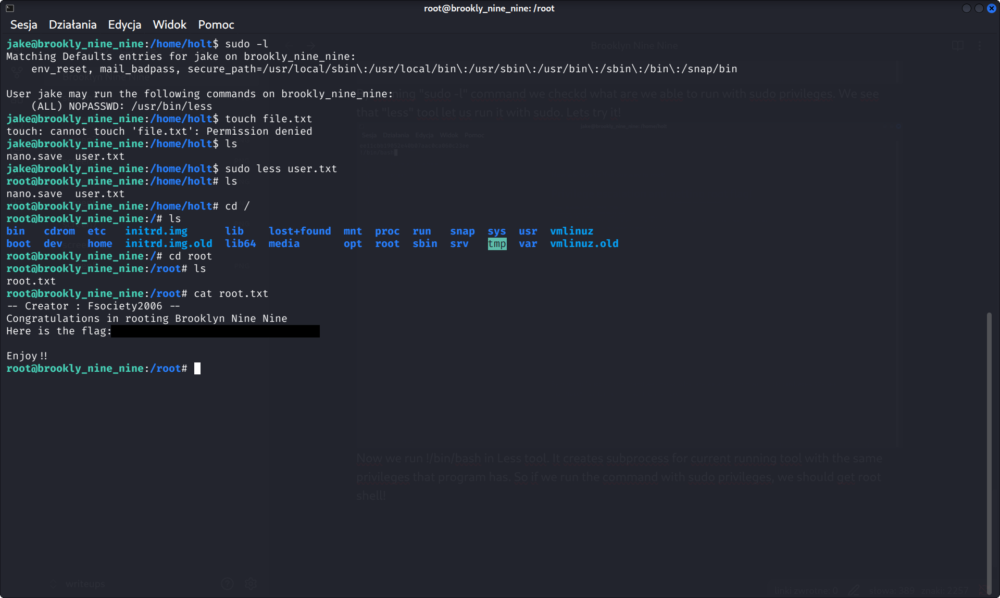

Writeup date: 21.09.2026
Name of challenge: Brooklyn Nine Nine
Difficulty: easy

# Reconnaissance
## Step 1 - Ping + nmap
First step is to gain some awareness about our target. First i've decided to ping THM Machine to verify vpn connection. Next I ran basic **Nmap** scan to see what ports we have open. 

As you can see, we have 3 standard ports open. Let's break those ports:
21/tcp -> typically ftp service
22/tcp -> most likely ssh service
80/tcp -> standard for websites

## Step 2 - Check if we can get something without "hacking"
We're now focusing on ports 21(ftp) and 80(web). In old or misconfigured versions of ftp there's an anonymous login giving us opportunity to log into service without any credentials. Let's dive into it
Now we have access to ftp service without even knowing the login! Now we can check existing files and search for something useful.
**We've found interesting note!** Amy says that Jake has weak password. Maybe we can try to break his password and log in to ssh? (Note that in this step we've found really promising attack vector. It's not necessary right now to check other opportunities)

# Breaking into SSH
We know that there's ssh service running on port 22. We'd like to access it with Jake's weak password. To achieve this we can use Hydra - brute force tool that helps breaking into various services

**We got it!** We've ran Hydra with "jake" username and passwords list "rockyou.txt". Note that we used lowercase version of username (it's standard in unix like systems). Now with his credentials we can log into SSH.

# Post-exploitation

After logging in and short walk-around we've found **user flag!** It was hidden in other's user folder in /home directory
**Now we have to find our way to root!**
# Privilege escalation and getting root flag!
By running ``sudo -l`` command we checkd what are we able to run with sudo privileges. We see that "less" tool let us run it with sudo. Lets try it!

Now we run ``!/bin/bash`` in Less tool. It creates subprocess for current running tool with the same privileges that program has. So if we run the command with sudo privileges, we should get root shell!

**And congrats!** After running command we gained root access. Now we've done little walk-around and found root flag! Our machine is finished!
